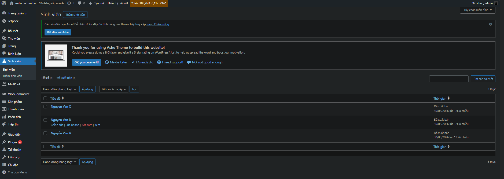
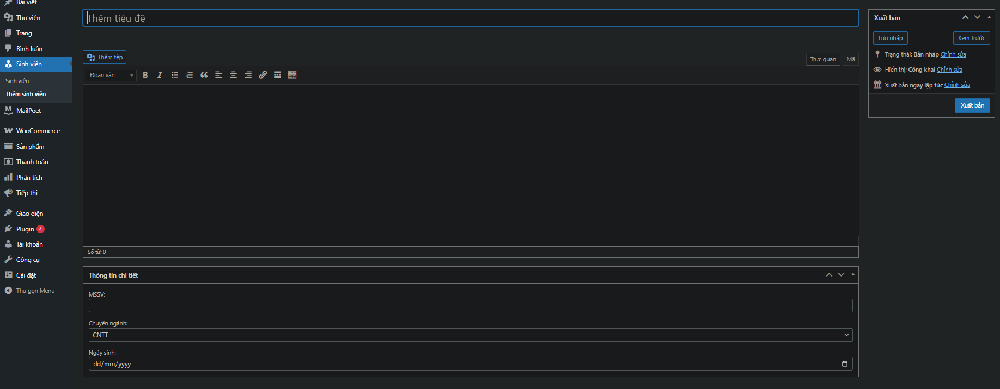
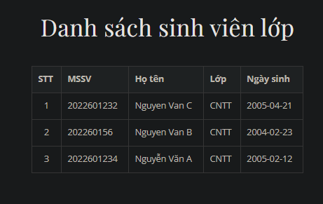

# Plugin: Student Manager - Quản lý Sinh viên

Đây là bài tập thực hành viết Plugin WordPress đáp ứng các yêu cầu về Custom Post Type, Meta Boxes và Shortcode.

## 1. Chức năng chính
- **Quản trị (Backend):** - Đăng ký Custom Post Type "Sinh viên".
  - Thêm Meta Box: MSSV (text), Chuyên ngành (dropdown), Ngày sinh (date).
  - Bảo mật: Sử dụng Nonce và Sanitize dữ liệu.
- **Hiển thị (Frontend):** - Sử dụng Shortcode `[danh_sach_sinh_vien]` để hiển thị bảng danh sách.

## 2. Kết quả thực hiện

### A. Giao diện Quản trị (Custom Post Type)
Đây là màn hình hiển thị danh sách các sinh viên đã được tạo.

### B. Khu vực nhập liệu (Meta Box & Nonce)
Hình ảnh này cho thấy các trường nhập liệu bổ sung: MSSV, Chuyên ngành, Ngày sinh. Đồng thời, code có sử dụng `wp_nonce_field` để bảo mật và `sanitize_text_field` để làm sạch dữ liệu.

### C. Hiển thị ngoài Frontend (Shortcode)
Đây là bảng danh sách sinh viên hiện ra ngoài trang chủ khi chèn shortcode `[danh_sach_sinh_vien]`. Bảng được định dạng bằng CSS từ file `assets/style.css`.

## 3. Cấu trúc thư mục
- `student-manager.php`: File chính của plugin.
- `includes/`: Chứa logic xử lý CPT, Meta Box và Shortcode.
- `assets/`: Chứa file CSS định dạng bảng.
